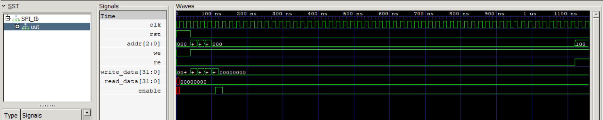
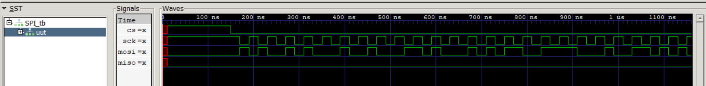
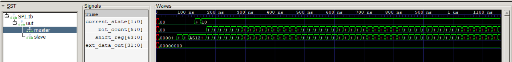
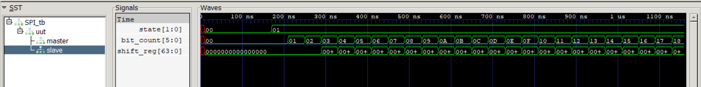

# SPI_Controller
This project implements a Serial Peripheral Interface (SPI) Controller in Verilog, consisting of a master, slave, and memory-mapped register interface. The design demonstrates full-duplex serial communication, finite state machine control, and data shifting operations.

The controller supports command, address, and data transfer between master and slave over standard SPI signals.

This project was developed as a learning exercise in digital design and RTL verification.

## Features 
- Memory-mapped register interface
- SPI Master and SPI Slave implementation
- Full-duplex serial communication
- FSM-based control logic
- Command, address, and data transfer
- GTKWave simulation support
- Modular RTL design
- Parameterized data shifting

## Architecture
The design consists of three main modules:

### 1. SPI Top Module
Acts as the register interface and connects master and slave.
| Address | Register |
|--------|----------|
| 000 | Enable |
| 001 | Command |
| 010 | Address |
| 011 | Data In |
| 100 | Data Out |

### 2. SPI Master
Responsible for:
- Generating chip select (CS)
- Generating serial clock (SCK)
- Sending command/address/data via MOSI
- Receiving data via MISO
- Controlling transfer using FSM

FSM States: IDLE, ENABLE, DATA

### 3. SPI Slave
Responsible for:
- Receiving serial data from MOSI
- Storing command/address/data
- Sending data back via MISO
- Managing transaction lifecycle

FSM States: IDLE, DATA, DISABLE

## SPI Signals

| Signal | Description |
|--------|------------|
| CS | Chip Select |
| SCK | Serial Clock |
| MOSI | Master Out Slave In |
| MISO | Master In Slave Out |

## Simulation 
Simulation is performed using: Icarus Verilog + GTKWave
The testbench performs multiple transactions including write and read operations.

### How to RUN simulation:

```bash
iverilog -o SPI_tb.vvp SPI_tb.v SPI.v SPI_master.v SPI_slave.v
vvp SPI_tb.vvp
gtkwave SPI.vcd
```

## Waveform Results
The waveform demonstrates:
- Chip select going low during transaction
- Serial clock toggling
- Data shifting on MOSI
- Data received on MISO
- FSM state transitions
- Successful readback of data

<p align="center">
   
</p>

<p align="center">
   
</p>

<p align="center">
   
</p>

<p align="center">
   
</p>

## Future Improvements
- Configurable SPI modes (CPOL/CPHA)
- Clock divider for realistic SPI timing
- Multiple slave support
- Interrupt support
- FIFO buffers
- Coverage driven verification
- SystemVerilog testbench
